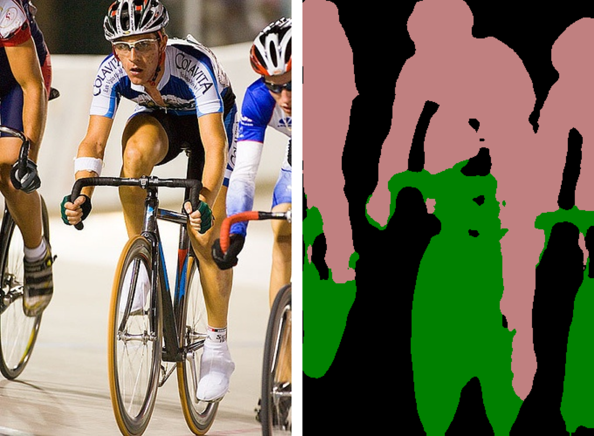
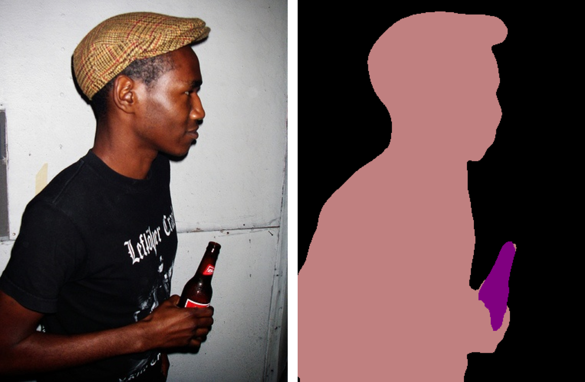
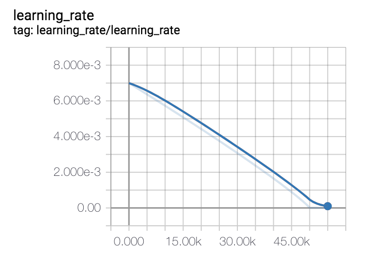
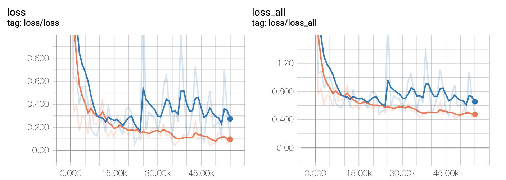

## About

A Tensorflow implementation of [Deeplabv3plus](http://openaccess.thecvf.com/content_ECCV_2018/papers/Liang-Chieh_Chen_Encoder-Decoder_with_Atrous_ECCV_2018_paper.pdf), trained on [VOC2012](http://host.robots.ox.ac.uk:8080/) data set.

## Difference from the paper [Deeplabv3plus](http://openaccess.thecvf.com/content_ECCV_2018/papers/Liang-Chieh_Chen_Encoder-Decoder_with_Atrous_ECCV_2018_paper.pdf)

+ training strategy
    
    We use small batch_size = 8, and don't train the BN layer.
    
+ atrous convolution
    
    We don't employ atrous convolution in the resnet model.

## Set up

#### Prepare dataset

+ **Config the path in the input_data.py**

The VOCdevkit directory should be as follows:

```
|--VOCdevkit
        |--train.txt         (10582 lines)
        |--val.txt           (1449 lines)
        |--test.txt          (1456 lines)
        |--train_raw.txt     (1464 lines)
        |--trainval_raw.txt  (2913 lines)
        |--VOC2012
            |--JPEGImages            (33260 images)
            |--SegmentationClass
            |--SegmentationClassAug  (12031 images)
            |--SegmentationObject
            |--ImageSets
            |--Annotations
```
    
+ **JPEGImages** is needed. Download it from [http://host.robots.ox.ac.uk/pascal/VOC/voc2012/VOCtrainval_11-May-2012.tar](http://host.robots.ox.ac.uk/pascal/VOC/voc2012/VOCtrainval_11-May-2012.tar) for **trainval set**, and [http://host.robots.ox.ac.uk:8080/eval/downloads/VOC2012test.tar](http://host.robots.ox.ac.uk:8080/eval/downloads/VOC2012test.tar) for **test data**.
+ **SegmentationClassAug** is needed. Download it from [https://www.dropbox.com/s/oeu149j8qtbs1x0/SegmentationClassAug.zip?dl=0](https://www.dropbox.com/s/oeu149j8qtbs1x0/SegmentationClassAug.zip?dl=0)

#### Prepare pretrained resnet-101 model

+ **Config the path in the deeplab_model.py**

The resnet_v2_101_2017_04_14 directory should be as follows:
    
```
|--resnet_v2_101_2017_04_14
               |--eval.graph
               |--resnet_v2_101.ckpt
               |-train.graph
```
    
**resnet_v2_101.ckpt** is needed. Download the directory(pretrained model) from [http://download.tensorflow.org/models/resnet_v2_101_2017_04_14.tar.gz](http://download.tensorflow.org/models/resnet_v2_101_2017_04_14.tar.gz)

#### Dependent libraries

+ Tensorflow 1.11 and Python 2.7(3.7) have been tested.
+ Anaconda
+ Opencv

## Inference

+ download checkpoint from [here](https://pan.baidu.com/s/1ELFnPgS3TRi3egXHr6LSBA)

+ randomly select images

    > python predict.py
   
+ select one image
    
    > python predict.py --prediction_on_which val --filename 2009_003804
    

## Evaluation

+ download checkpoint from [here](https://pan.baidu.com/s/1ELFnPgS3TRi3egXHr6LSBA)

 > python evaluate.py

+ for val data, generate prediction results and get mIoU.
+ for test data,  generate prediction results.


## Re-Train to reproduce the result
+ rm -r checkpint
+ rm -r summary
> python train.py

## Results

#### on val set

| Repo(%) | Paper(%) |
| :---: | :----: |
| **75.84** | 79.35 |

| sheep | horse | tv/monitor | bicycle | aeroplane | cow | dining table | bus | potted plant | background | dog | cat | person | train | bottle | car | chair | sofa | bird | boat | motorbike |
| :---: | :----: | :---: | :----: | :----: | :----: | :----: | :----: | :----: | :----: | :----: | :----: | :----: | :----: | :----: | :----: | :----: | :----: | :----: | :----: | :----: | :----: |
| 0.85 | 0.84 | 0.67 | 0.41 | 0.88 | 0.86 | 0.56 | 0.92 | 0.59 | 0.94 | 0.86 | 0.9 | 0.84 | 0.88 | 0.78 | 0.82 | 0.41 | 0.54 | 0.88 | 0.66 | 0.83 |

#### predicted images






**Note:** **left** image is raw image, **right** image is the predicted image.

#### learning rate



#### loss




## Reference
+ [https://github.com/rishizek/tensorflow-deeplab-v3-plus](https://github.com/rishizek/tensorflow-deeplab-v3-plus)
+ [https://github.com/DrSleep/tensorflow-deeplab-resnet](https://github.com/DrSleep/tensorflow-deeplab-resnet)
+ [https://github.com/tensorflow/models/tree/master/research/deeplab](https://github.com/tensorflow/models/tree/master/research/deeplab)
